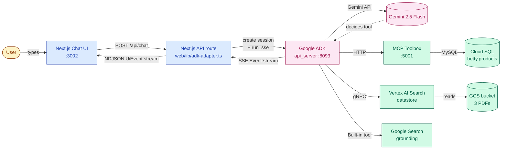
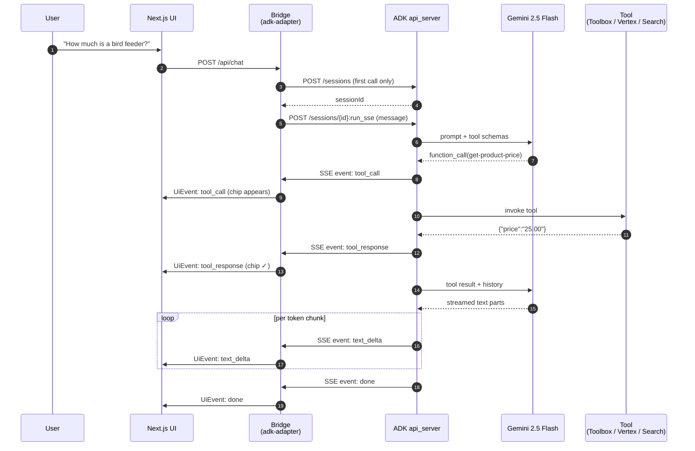
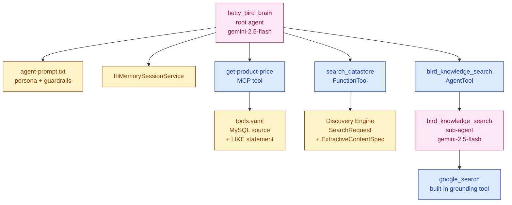
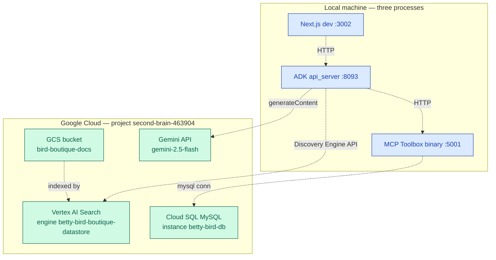

# Architecture

## System



## Request lifecycle



## Agent composition



## Frontend streaming bridge

```mermaid
flowchart LR
    subgraph ADK[ADK SSE Event types]
        E1[part: text]
        E2[part: functionCall]
        E3[part: functionResponse]
        E4[turn complete]
    end

    subgraph Adapter[web/lib/adk-adapter.ts]
        F[translate event<br/>per part]
    end

    subgraph UI[UiEvent types]
        U1[session]
        U2[tool_call]
        U3[tool_response]
        U4[text_delta]
        U5[done]
    end

    E1 --> F --> U4
    E2 --> F --> U2
    E3 --> F --> U3
    E4 --> F --> U5
    F --> U1

    subgraph React[React client]
        State[ChatMessage state<br/>+ ToolEvent[]]
    end

    U1 --> State
    U2 --> State
    U3 --> State
    U4 --> State
    U5 --> State

    classDef adk fill:#fce7f3,stroke:#9d174d,color:#9d174d;
    classDef ui fill:#dbeafe,stroke:#1e40af,color:#1e40af;
    classDef bridge fill:#fef3c7,stroke:#92400e,color:#92400e;
    class E1,E2,E3,E4 adk;
    class U1,U2,U3,U4,U5 ui;
    class F,State bridge;
```

## Deployment topology


